[mermaid 공식문서](https://mermaid-js.github.io/mermaid/#/)

* flow

```flow
st=>start: Start
e=>end
op1=>operation: My Operation
sub1=>subroutine: My Subroutine
cond=>condition: Yes
or No?:>http://www.google.com
io=>inputoutput: catch something
st->op1->cond
cond(yes)->io->e
cond(no)->sub1(right)->op1
```

* sequence

```sequence
Alice->Bob: Hello Bob, how are you?
Note right of Bob: Bob thinks
Bob-->Alice: I am good thanks!
```

* dot

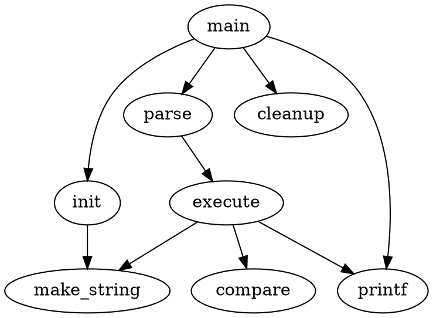

* mermaid: flowchart

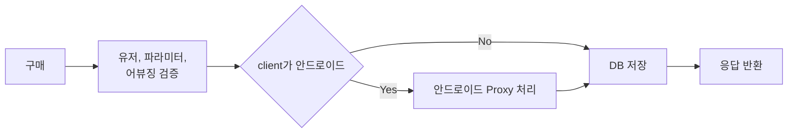

* mermaid: flowchart

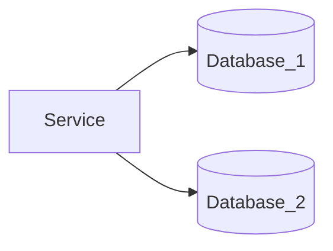

* mermaid: graph basic

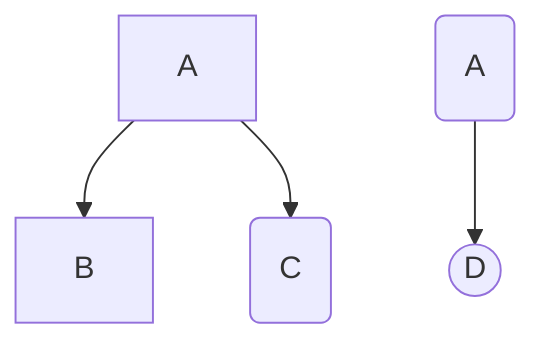

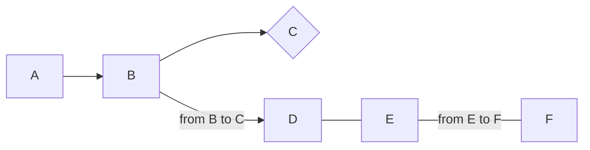


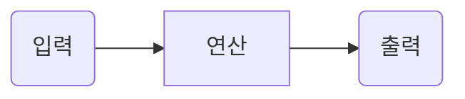

* mermaid: graph

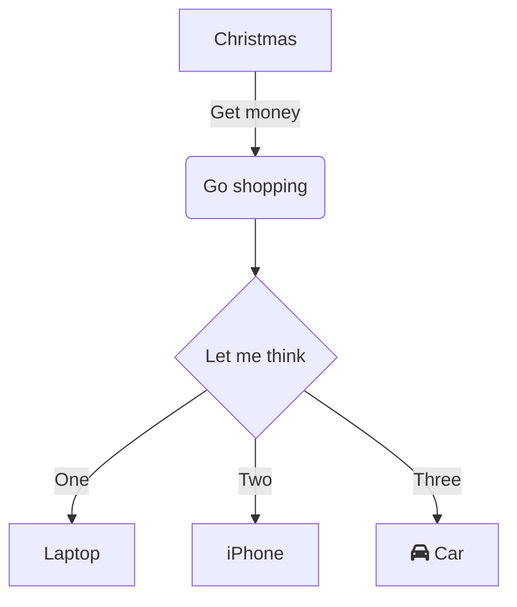

* mermaid: graph

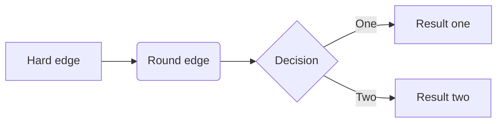

* mermaid: sequence

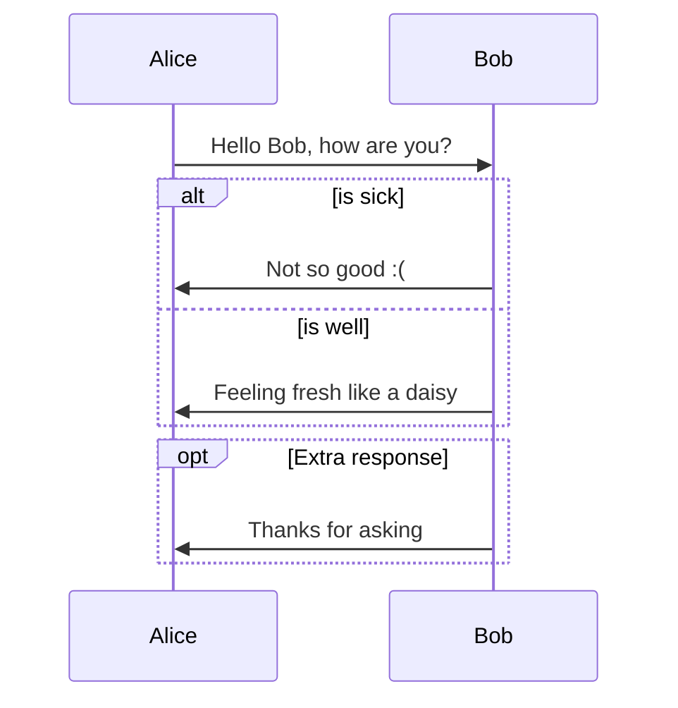


* mermaid: class diagram

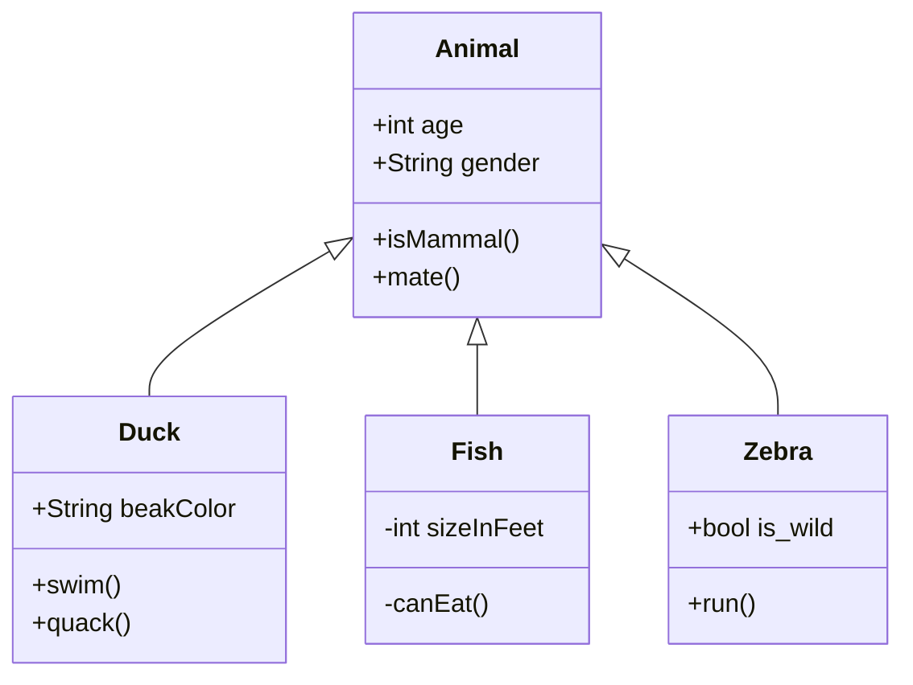


* mermaid: state diagram

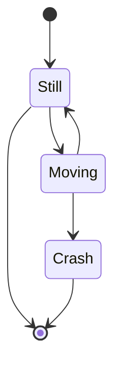

* mermaid: pie chart

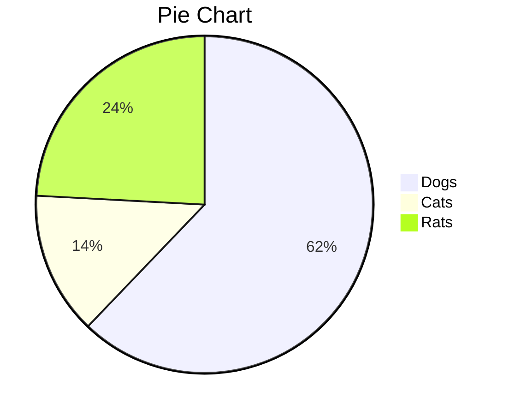

* mermaid: gantchart

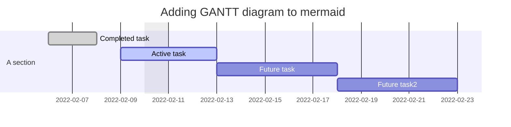
